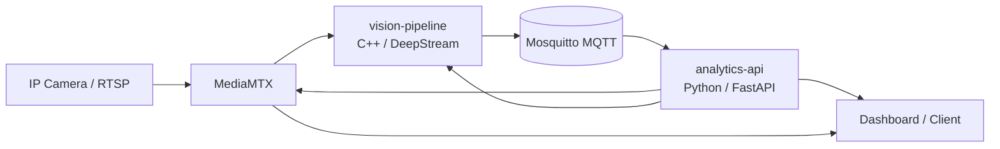

# Headpose Camera IP

**English** | [Tiếng Việt](README.vi.md)

## English

Real-time head-pose and gaze-direction estimation from multiple IP cameras. The
system uses DeepStream/TensorRT in a C++ vision service and FastAPI for business
logic, alerts, camera control, and WebSocket delivery.

### Goals

- Process multiple RTSP streams with GPU/NVMM zero-copy where available.
- Add and remove cameras while the system is running.
- Keep GPU-heavy inference in C++ and application logic in Python.
- Expose results through MQTT, REST, and WebSocket APIs.

### Architecture and data flow

The architecture consists of MediaMTX (single RTSP pull point and WebRTC/WHEP),
the C++/DeepStream vision pipeline, the Python analytics API, and Mosquitto.
The full architecture and control/data-plane details are in
[docs/architecture.md](docs/architecture.md).



### Technology and repository layout

| Component | Responsibility | Interface |
| --- | --- | --- |
| `vision-pipeline` | Decode, batch, PeopleNet, tracking, FaceMesh TensorRT, metadata | gRPC `:50051`, MQTT `:1883` |
| `analytics-api` | Pose/gaze calculation, filtering, alerts, camera proxy, WebSocket | HTTP `:8080`, gRPC, MQTT |
| `mediamtx` | Single camera pull and RTSP/WebRTC distribution | `8554`, `8889`, `9997` |
| `mqtt-broker` | Real-time message bus | MQTT `:1883` |

Source code is under `services/`, deployment files under `deployments/`, model
configuration under `models/`, and public technical documentation under `docs/`.

### Requirements and configuration

Production deployment targets NVIDIA Jetson with DeepStream 7.0, TensorRT, and
C++17. The analytics service requires Python 3.10 and its dependencies in
`services/analytics_api/requirements.txt`. Copy `deployments/.env.example` to a
local `.env` and set camera URLs, broker/API endpoints, and public RTSP/WebRTC
hosts. Credentials and generated model artifacts must remain local.

### Running and testing

Use the development or production Docker Compose file under
`deployments/docker/`. Backend tests can be run with:

```bash
make test
```

The API exposes health, camera management, gaze history/latest, alerts, and
WebSocket endpoints; see [docs/api_reference.md](docs/api_reference.md).

### Related documentation

- [Architecture and design](docs/architecture.md)
- [API reference](docs/api_reference.md)
- [Benchmarks](docs/benchmarks.md)

Detailed interview/deep-dive notes are kept privately and are intentionally not
tracked or linked from the public repository.
