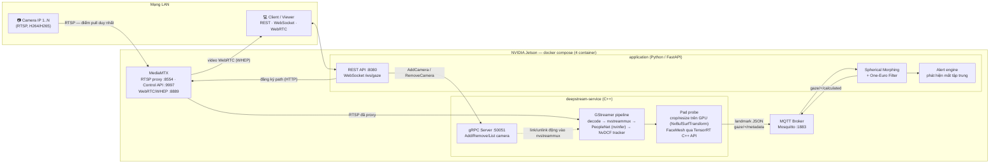
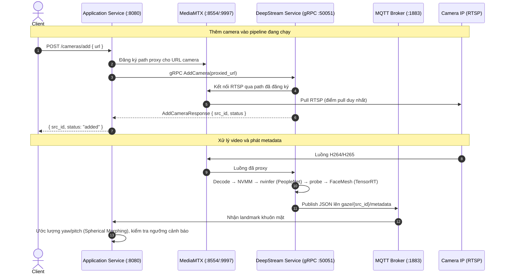

# Headpose Camera IP — DeepStream Microservices Pipeline

[](https://github.com/quanganh2k4/head-pose-estimation/actions/workflows/ci.yml)
[](LICENSE)


Hệ thống nhận diện hướng nhìn (gaze) và dáng đầu (head pose) theo thời gian thực từ nhiều camera IP, xây dựng trên nền NVIDIA DeepStream SDK và GStreamer, chạy trên thiết bị edge Jetson. Mục tiêu ban đầu là phát hiện tình trạng người dùng mất tập trung (nhìn lệch khỏi camera quá lâu) để phục vụ giám sát, và bài toán đặt ra buộc toàn bộ pipeline — từ decode video, inference, đến tổng hợp metadata — phải chạy đủ nhanh trên phần cứng Jetson hạn chế tài nguyên.

Bản đầu tiên của dự án là một script Python nguyên khối (`src/test/scripts/streammux_python_peoplenet_gaze_v6_mqtt.py`) dùng để thử nghiệm nhanh pipeline PeopleNet + FaceMesh. Sau khi xác nhận thuật toán hoạt động đúng, toàn bộ phần inference được viết lại bằng C++ native để loại bỏ overhead của Python/GIL, đồng thời hệ thống được tách thành các microservices giao tiếp qua gRPC và MQTT để tách biệt phần AI inference (cần GPU) khỏi phần business logic (chạy CPU), và cho phép thêm/bớt camera vào pipeline đang chạy mà không cần khởi động lại toàn bộ service.

---

## Kiến trúc hệ thống



Hệ thống gồm 4 service độc lập, mỗi service chạy trong container riêng và giao tiếp qua mạng nội bộ:

**deepstream-service (C++ / GStreamer / TensorRT)**
Lõi xử lý AI của hệ thống. Nhận luồng RTSP, chạy PeopleNet (phát hiện người + tracking bằng NvDCF) và FaceMesh (trích xuất landmark khuôn mặt) qua TensorRT C++ API, toàn bộ nằm trong một pipeline GStreamer duy nhất. Dữ liệu ảnh được giữ trong NVMM (NVIDIA Memory Management) xuyên suốt để tránh copy giữa CPU và GPU, và các phép biến đổi ảnh (crop, resize theo bounding box) chạy song song trên GPU qua `NvBufSurfTransform`. Service này expose một gRPC server ở cổng 50051 để thêm hoặc xóa camera khỏi pipeline đang chạy (link/unlink động vào `nvstreammux`, có khóa mutex để an toàn khi nhiều request đến cùng lúc), và publish kết quả inference dưới dạng JSON qua MQTT bằng `libmosquitto`.

**application (Python / FastAPI)**
Service xử lý logic nghiệp vụ, chạy trên image `python:3.10-slim` không cần GPU. Subscribe metadata từ MQTT, chạy thuật toán ước lượng head pose (Spherical Morphing, mô tả bên dưới) trên landmark nhận được, theo dõi trạng thái mất tập trung của từng người theo từng camera, và expose REST API ở cổng 8080 để client bên ngoài quản lý camera và đọc dữ liệu. Service này cũng đóng vai trò gRPC client gọi xuống `deepstream-service` khi có yêu cầu thêm/xóa camera.

**mediamtx**
Điểm pull RTSP duy nhất từ camera vật lý. Khi một camera được thêm qua REST API, `application` đăng ký path tương ứng trên mediamtx (qua control API cổng 9997) trước, sau đó mới gọi gRPC để `deepstream-service` kết nối vào URL đã được proxy qua mediamtx thay vì URL gốc của camera. Cách làm này tránh việc camera bị pull nhiều lần cùng lúc bởi cả deepstream-service lẫn các viewer khác, vốn dễ làm cạn số kết nối đồng thời mà nhiều camera IP giá rẻ hỗ trợ.

**mqtt-broker (Eclipse Mosquitto)**
Message bus kết nối `deepstream-service` và `application`, độ trễ thấp, không giữ trạng thái.

---

## Luồng hoạt động



---

## Thuật toán ước lượng head pose

Thay vì dùng cách tiếp cận PnP (solvePnP) phổ biến — vốn nhạy với nhiễu landmark và cần calibration camera — hệ thống dùng phương pháp Spherical Morphing dựa trên 5 điểm mốc trên khuôn mặt (mũi, cằm, hai mắt, sống mũi), khớp với một mô hình khuôn mặt 3D chuẩn. Phần triển khai ([head_pose_algo.py](services/application/modules/head_pose_algo.py)) bổ sung thêm:

- **One-Euro Filter** để lọc nhiễu thích ứng theo tốc độ chuyển động, giảm rung ở trạng thái đứng yên mà vẫn phản ứng nhanh khi đầu quay nhanh.
- **Geometric Consistency Check** để phát hiện landmark bất thường (do che khuất một phần khuôn mặt, góc nghiêng quá lớn) trước khi đưa vào ước lượng.
- **Dynamic Subset Projector** cho phép ước lượng pose ngay cả khi thiếu một vài điểm landmark, thay vì bỏ qua toàn bộ frame.

Kết quả yaw/pitch/roll và vector hướng nhìn được dùng để phát cảnh báo khi một người nhìn lệch khỏi camera quá một ngưỡng góc (mặc định 45° yaw / 30° pitch) trong một khoảng thời gian liên tục (mặc định 3 giây), có thể cấu hình qua biến môi trường.

---

## Cấu trúc thư mục

```
├── .github/workflows/ci.yml       CI: lint + unit test thuật toán trên mỗi push/PR
├── deployment/                    Cấu hình triển khai
│   ├── docker-compose.yml         Định nghĩa 4 service
│   ├── .env.example                Mẫu cấu hình camera (credential nằm trong .env, không commit)
│   ├── mediamtx.yml                Cấu hình MediaMTX
│   └── mosquitto.conf              Cấu hình MQTT broker
├── services/
│   ├── application/                Business logic + REST API (Python/FastAPI)
│   │   ├── main.py
│   │   ├── modules/head_pose_algo.py   Thuật toán Spherical Morphing
│   │   ├── static/viewer.html          Trang xem trực tiếp qua WebRTC
│   │   └── tests/                      Unit test cho thuật toán head pose
│   └── deepstream/                 AI inference service (C++)
│       ├── CMakeLists.txt
│       ├── proto/camera.proto      Định nghĩa gRPC API quản lý camera
│       └── src/
│           ├── main.cpp            Khởi tạo gRPC server + GLib main loop
│           ├── pipeline.cpp        Xây dựng và quản lý GStreamer pipeline động
│           └── probe_processor.cpp Đọc metadata inference, TensorRT FaceMesh, GPU transform
├── models/                         Config, label, custom parser cho PeopleNet/FaceMesh/RetinaFace/SCRFD
│                                   (file trọng số .onnx/.engine không nằm trong repo, xem phần Models)
├── gaze_viewer.py                  Công cụ debug: overlay yaw/pitch/gaze lên video, dùng khi phát triển
└── src/test/scripts/               Bản prototype Python nguyên khối trước khi tách microservices
```

---

## Models

Các file trọng số (`.onnx`, `.engine`) không được đưa vào repo vì kích thước lớn (trên 100MB với RetinaFace) và vì TensorRT engine phải build lại theo đúng phần cứng/driver của máy chạy. Repo chỉ giữ lại config, label và mã nguồn custom parser. Để chạy được hệ thống, cần tự chuẩn bị:

- `models/peoplenet/resnet34_peoplenet_int8.onnx` — NVIDIA PeopleNet (tải từ NGC catalog)
- `models/mediapipe_pose/.../face_mesh_192x192_post.onnx` — FaceMesh, export từ MediaPipe kèm hậu xử lý ONNX
- `models/retinaface/`, `models/scrfd/` — dùng cho các thử nghiệm phát hiện khuôn mặt thay thế

TensorRT engine (`.engine`) sẽ được `nvinfer` tự build ở lần chạy đầu tiên dựa trên file ONNX và config tương ứng.

---

## Triển khai

### Yêu cầu

- Thiết bị NVIDIA Jetson (JetPack 6.x, DeepStream 7.0 trở lên) hoặc máy có GPU NVIDIA hỗ trợ tương đương.
- Docker và NVIDIA Container Toolkit.
- Camera IP hỗ trợ RTSP.

### Các bước

1. Chuẩn bị model theo hướng dẫn ở phần Models bên trên.

2. Tạo file cấu hình môi trường từ mẫu và điền URL camera thật (URL chứa
   user/password của camera nên nằm trong `.env` — file này đã được gitignore,
   không bao giờ commit credential lên repo):
   ```bash
   cd deployment
   cp .env.example .env
   # Sửa CAMERA_URLS và MEDIAMTX_PUBLIC_RTSP_HOST trong .env
   ```
   Ngưỡng cảnh báo cấu hình trong [deployment/docker-compose.yml](deployment/docker-compose.yml):
   ```yaml
   - YAW_ALERT_DEG=45.0
   - PITCH_ALERT_DEG=30.0
   - ALERT_DURATION_S=3.0
   ```

3. Build và khởi chạy:
   ```bash
   cd deployment
   sudo docker compose up -d --build
   ```

4. Theo dõi log:
   ```bash
   sudo docker compose logs -f deepstream-service
   sudo docker compose logs -f application
   ```

5. Thêm hoặc xóa camera mà không cần khởi động lại:
   ```bash
   curl -X POST http://localhost:8080/cameras/add \
        -H 'Content-Type: application/json' \
        -d '{"url": "rtsp://user:password@<ip_camera_moi>/stream"}'

   curl -X DELETE http://localhost:8080/cameras/2
   ```

---

## REST API

Tài liệu tương tác (Swagger UI, ReDoc) có sẵn tại `/docs` và `/redoc` khi service `application` chạy.

| Method | Endpoint | Mô tả |
|---|---|---|
| GET | `/cameras` | Danh sách camera đang active |
| POST | `/cameras/add` | Thêm camera mới vào pipeline |
| DELETE | `/cameras/{src_id}` | Xóa camera khỏi pipeline |
| GET | `/health` | Trạng thái kết nối MQTT và camera active |
| GET | `/gaze/latest` | Dữ liệu gaze mới nhất của tất cả camera |
| GET | `/gaze/{cam_id}/history?n=60` | Lịch sử N frame gần nhất của một camera |
| GET | `/alerts?limit=50` | Danh sách cảnh báo mất tập trung gần đây |
| WS | `/ws/gaze/{cam_id}` | Nhận metadata gaze theo thời gian thực qua WebSocket |

---

## Định dạng tin nhắn MQTT

`deepstream-service` publish metadata lên topic `gaze/{src_id}/metadata`; sau khi `application` tính toán yaw/pitch, kết quả được publish lại lên `gaze/{src_id}/calculated`:

```json
{
  "device_id": "jetson-edge",
  "camera_id": 0,
  "timestamp": 1782870181.42,
  "objects": [
    {
      "object_id": 14,
      "class_id": 0,
      "bbox": [100, 150, 250, 400],
      "yaw": -12.4,
      "pitch": 5.8,
      "gaze": [-0.214, 0.101, 0.972],
      "conf": 0.91
    }
  ]
}
```

---

## Kiểm thử

Thuật toán head pose là phần thuần Python (numpy/scipy) nên test được trên máy
bất kỳ, không cần GPU hay DeepStream. Bộ test tạo dữ liệu tổng hợp bằng cách
chiếu mô hình khuôn mặt 3D đã xoay một góc yaw/pitch biết trước xuống 2D, rồi
kiểm tra estimator khôi phục đúng góc đó — đồng thời phủ các nhánh xử lý
landmark bị che khuất và bộ lọc One-Euro:

```bash
pip install numpy scipy pytest
pytest services/application/tests/ -v
```

CI ([.github/workflows/ci.yml](.github/workflows/ci.yml)) chạy lint + toàn bộ
unit test trên mỗi push/PR. Phần C++ (DeepStream/TensorRT) chỉ build được trên
Jetson nên nằm ngoài CI và được kiểm thử trực tiếp trên thiết bị.

---

## Ghi chú bảo mật

Hệ thống được thiết kế chạy trong mạng LAN tin cậy trên thiết bị edge; các
quyết định bảo mật hiện tại và giới hạn của chúng:

- **Credential camera** (user/pass trong URL RTSP) chỉ nằm trong `deployment/.env`
  — file này được gitignore và không bao giờ commit. Tên path đăng ký trên
  MediaMTX là hash của URL, nên credential không lộ ra ở URL viewer phía ngoài.
- **MQTT** (`allow_anonymous true`) và **gRPC** (insecure channel) không bật
  auth/TLS vì cả hai chỉ giao tiếp loopback giữa các container trên cùng thiết bị.
  Nếu tách service ra nhiều máy, cần bật user/password cho Mosquitto và TLS cho gRPC.
- **REST API** mở CORS `*` để tiện phát triển dashboard; khi triển khai thật
  nên giới hạn origin và đặt API sau reverse proxy có auth.

---

## Giấy phép

Dự án phát hành theo giấy phép [MIT](LICENSE).
