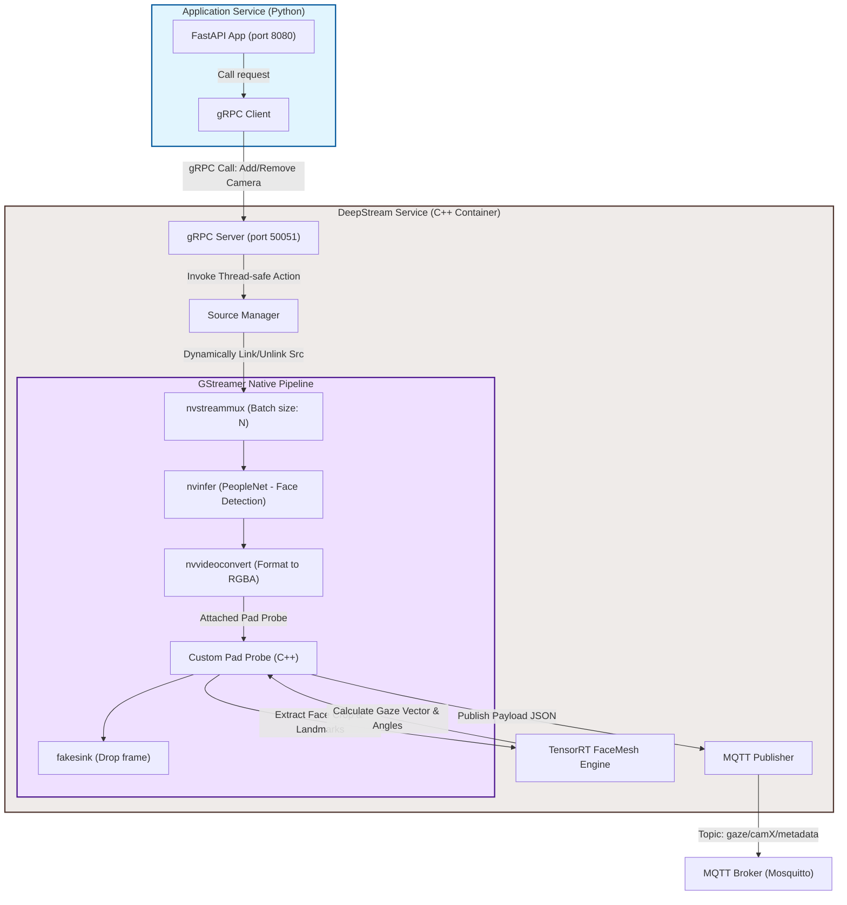

# Kế hoạch Triển khai: Chuyển đổi deepstream-service sang C++ & gRPC

Bản kế hoạch này mô tả chi tiết phương án tối ưu hóa hiệu năng cho `deepstream-service` trên thiết bị NVIDIA Jetson bằng cách chuyển dịch toàn bộ mã nguồn xử lý và quản lý camera từ Python sang C++ native, kết hợp với gRPC làm phương thức truyền thông liên dịch vụ.

---

## 1. Danh sách các thư viện C++ cần thiết

Để xây dựng dịch vụ DeepStream bằng C++ ổn định và hiệu năng cao, chúng ta cần cài đặt và tích hợp các thư viện sau:

| Thư viện | Vai trò | Ghi chú cài đặt trên Jetson |
| :--- | :--- | :--- |
| **DeepStream SDK & GStreamer 1.0** | Framework chính để xây dựng pipeline video, decode và chạy inference AI | Có sẵn trong base image `nvcr.io/nvidia/deepstream-l4t:7.0-triton-multiarch` |
| **gRPC & Protocol Buffers (C++)** | Thiết lập gRPC Server để ứng dụng Python gọi API thêm/xóa camera động | Cài đặt từ package manager hoặc compile từ nguồn (source) trong Docker |
| **Eclipse Mosquitto (libmosquitto-dev)** | C++ Client dùng để publish dữ liệu metadata lên MQTT Broker | Package chính thức: `libmosquitto-dev` / `libmosquittopp-dev` |
| **OpenCV C++** | Resize ảnh khuôn mặt và thực hiện chuyển đổi định dạng ảnh | Có sẵn trong base image DeepStream của NVIDIA |
| **TensorRT C++ API** | Load mô hình ONNX FaceMesh và thực hiện suy luận (inference) ở mức C++ | Tích hợp sẵn trong JetPack / DeepStream |
| **nlohmann/json** | Thư viện C++ hỗ trợ serialize dữ liệu trước khi bắn qua MQTT | Header-only library, dễ dàng tích hợp qua CMake |

---

## 2. Cấu trúc thư mục mới của dịch vụ

Sau khi chuyển đổi, cấu trúc thư mục của `services/deepstream` sẽ chuyển từ cấu trúc Python sang cấu trúc C++ chuẩn hóa CMake như sau:

```text
services/deepstream/
├── CMakeLists.txt                 # File cấu hình biên dịch cho toàn bộ project C++
├── Dockerfile                     # Dockerfile tối ưu (Multi-stage build)
├── proto/
│   └── camera.proto               # File định nghĩa API gRPC quản lý camera
└── src/
    ├── main.cpp                   # Điểm khởi chạy chính: Start gRPC Server và GLib MainLoop
    ├── pipeline.cpp               # Logic khởi tạo, chạy và giám sát GStreamer Pipeline
    ├── pipeline.hpp
    ├── source_manager.cpp         # Quản lý add/remove nguồn RTSP động (C++ thread-safe)
    ├── source_manager.hpp
    ├── probe.cpp                  # Hàm callback (pad probe) xử lý metadata, FaceMesh và Gaze
    ├── probe.hpp
    ├── inference.cpp              # Đọc FaceMesh bằng TRT C++ API và tính góc quay đầu/nhìn
    ├── inference.hpp
    └── mqtt_publisher.cpp         # Lớp wrapper kết nối và gửi dữ liệu lên MQTT Broker
    └── mqtt_publisher.hpp
```

---

## 3. Cách cài đặt gRPC trên Docker Jetson (nvcr.io/nvidia/deepstream-l4t)

Base image của DeepStream 7.0 sử dụng Ubuntu 22.04. Để tránh làm phình kích thước Docker image cuối cùng, ta áp dụng kỹ thuật **Multi-stage Build**:
* **Stage 1 (Builder):** Cài đặt đầy đủ compiler, build-essential, clone và build gRPC / Protobuf từ mã nguồn.
* **Stage 2 (Runtime):** Chỉ copy các file thư viện liên kết động (`.so`) và file thực thi (binary) từ Stage 1 sang.

Dưới đây là cấu trúc cài đặt gRPC mẫu trong `Dockerfile` C++:

```dockerfile
# ── STAGE 1: BUILDER ──────────────────────────────────────────────────────────
FROM nvcr.io/nvidia/deepstream-l4t:7.0-triton-multiarch AS builder

ENV DEBIAN_FRONTEND=noninteractive

# Cài đặt các công cụ build
RUN apt-get update && apt-get install -y --no-install-recommends \
    build-essential cmake git autoconf libtool pkg-config \
    libgflags-dev libgtest-dev clang libc++-dev \
    libmosquitto-dev libssl-dev \
    && rm -rf /var/lib/apt/lists/*

# Clone và cài đặt gRPC & Protobuf từ source (ví dụ bản v1.50.0 ổn định)
WORKDIR /third_party
RUN git clone --recurse-submodules -b v1.50.0 --depth 1 --shallow-submodules https://github.com/grpc/grpc.git \
    && cd grpc \
    && mkdir -p cmake/build \
    && cd cmake/build \
    && cmake -DgRPC_INSTALL=ON \
             -DgRPC_BUILD_TESTS=OFF \
             ../.. \
    && make -j$(nproc) \
    && make install \
    && ldconfig

# Build C++ Application
WORKDIR /workspace
COPY . .
RUN mkdir build && cd build && cmake .. && make -j$(nproc)

# ── STAGE 2: RUNTIME ──────────────────────────────────────────────────────────
FROM nvcr.io/nvidia/deepstream-l4t:7.0-triton-multiarch

ENV DEBIAN_FRONTEND=noninteractive

# Chỉ cài runtime dependencies của gRPC, mosquitto
RUN apt-get update && apt-get install -y --no-install-recommends \
    libmosquitto1 \
    && rm -rf /var/lib/apt/lists/*

# Copy thư viện gRPC và binary đã biên dịch từ Builder
COPY --from=builder /usr/local/lib/ /usr/local/lib/
COPY --from=builder /usr/local/bin/ /usr/local/bin/
COPY --from=builder /workspace/build/deepstream_gRPC_service /app/deepstream_gRPC_service

RUN ldconfig
WORKDIR /app
ENTRYPOINT ["./deepstream_gRPC_service"]
```

---

## 4. Sơ đồ thiết kế Pipeline C++ & Tương tác gRPC

Quy trình hoạt động của hệ thống chạy hoàn toàn bằng C++ được minh họa qua sơ đồ sau:



### Chi tiết thiết kế luồng xử lý (Data Flow) trong C++:
1. **Quản lý Camera động:** Khi Client yêu cầu `AddCamera`, `Source Manager` sẽ tạo một `uridecodebin` mới, thiết lập lắng nghe tín hiệu `pad-added`. Khi pad đã sẵn sàng, nó sẽ block và link vào một request pad trống của `nvstreammux` một cách an toàn mà không làm sập pipeline đang chạy.
2. **Xử lý Frame tối ưu:** Trong hàm callback `Probe`, chúng ta duyệt danh sách metadata của Deepstream (`NvDsBatchMeta`). Do ở tầng C++ native, ta có thể lấy trực tiếp con trỏ vùng nhớ ảnh mà không cần copy sang Python.
3. **Suy luận AI Face Mesh:** Hàm `inference` sẽ gọi trực tiếp TensorRT C++ API để nạp mô hình Mesh đã tối ưu, nhận kết quả tọa độ các điểm mốc (landmarks), sau đó tính toán vector nhìn hướng mắt (gaze) và các góc xoay đầu (yaw, pitch) bằng các hàm ma trận toán học C++ chuẩn xác, nhanh hơn nhiều so với dùng ONNX Runtime trên Python.
4. **Publish MQTT:** Kết quả tính toán được đóng gói thành chuỗi JSON cực nhanh thông qua thư viện header-only `nlohmann/json` và đẩy lên MQTT Broker thông qua thư viện `mosquitto.h`.

---

> [!IMPORTANT]
> **Giai đoạn tiếp theo:**
> 1. Viết và tích hợp file định nghĩa `proto/camera.proto`.
> 2. Cấu hình CMake để tự sinh code gRPC cho cả C++ và Python.
> 3. Tiến hành viết thử nghiệm `src/source_manager.cpp` (bằng C++) để hoàn thiện phần xương sống của Pipeline động.
