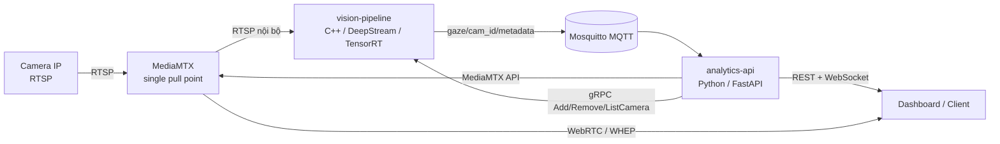
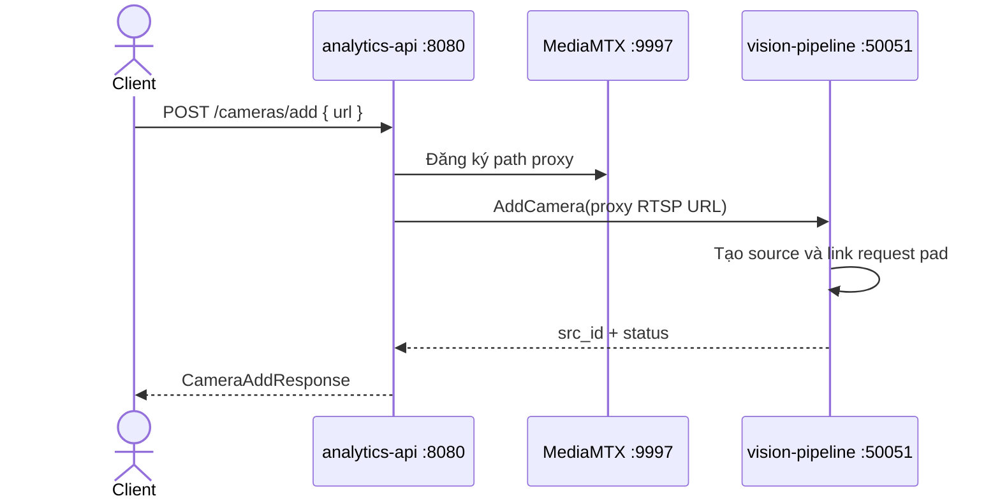

# Kiến trúc hệ thống

Tài liệu này mô tả cách các thành phần phối hợp với nhau và những quy ước cần giữ khi mở rộng hệ thống. Mục tiêu là để một người mới có thể trả lời nhanh ba câu hỏi:

1. Video đi qua những thành phần nào?
2. Dữ liệu được trao đổi bằng giao thức nào?
3. Khi thay đổi một tính năng thì cần sửa ở đâu?

## 1. Tổng quan

Hệ thống gồm bốn service/container. Mỗi service có một trách nhiệm rõ ràng:

| Thành phần | Trách nhiệm | Giao tiếp chính |
| --- | --- | --- |
| `mediamtx` | Kéo RTSP từ camera đúng một lần, cung cấp RTSP nội bộ và WebRTC/WHEP cho client | RTSP `:8554`, API `:9997`, WebRTC `:8889` |
| `vision-pipeline` | Decode, batch, phát hiện người, tracking và suy luận FaceMesh trên GPU | gRPC `:50051`, MQTT `:1883` |
| `analytics-api` | API điều khiển, tính head pose/gaze, lọc nhiễu, cảnh báo và relay WebSocket | HTTP/WebSocket `:8080`, gRPC, MQTT, MediaMTX API |
| `mqtt-broker` | Message bus cho dữ liệu theo thời gian thực | MQTT `:1883` |

## 2. Hai loại giao tiếp

### 2.1. Control plane: gRPC và MediaMTX API

Control plane dùng cho các thao tác ít xảy ra nhưng cần phản hồi ngay:

Luồng xóa camera đi theo chiều ngược lại: `analytics-api` gọi `RemoveCamera`, pipeline tháo pad và giải phóng source, sau đó API xóa path proxy trên MediaMTX.

Contract của control plane nằm tại [api/proto/camera_service.proto](../api/proto/camera_service.proto). Khi đổi request/response, cần cập nhật proto, code generated và cả client Python/server C++.

### 2.2. Data plane: RTSP, MQTT và WebSocket

Data plane dùng cho dòng dữ liệu liên tục:

1. MediaMTX kéo camera thật và tạo một path nội bộ.
2. `vision-pipeline` đọc path nội bộ bằng GStreamer.
3. Pad probe lấy metadata từ DeepStream, crop khuôn mặt trên GPU và chạy FaceMesh TensorRT.
4. Kết quả landmark được publish lên `gaze/<camera_id>/metadata`.
5. `analytics-api` subscribe, tính pose/gaze, áp dụng filter và publish kết quả lên `gaze/<camera_id>/calculated`.
6. Dashboard nhận dữ liệu qua WebSocket và nhận video trực tiếp từ MediaMTX bằng WebRTC/WHEP.

MQTT dùng cho stream/event; không dùng MQTT để điều khiển lifecycle camera. gRPC dùng cho command; không dùng gRPC để vận chuyển từng frame hoặc từng landmark.

## 3. Ranh giới trách nhiệm trong code

### `services/vision_pipeline/`

- `src/main.cpp`: khởi tạo process, MQTT client và gRPC server.
- `src/pipeline.cpp`: tạo pipeline GStreamer/DeepStream, `nvstreammux`, detector và tracker.
- `src/probe_processor.cpp`: xử lý metadata trong pad probe, GPU crop, TensorRT FaceMesh và publish MQTT.
- `proto/` và `api/proto/`: contract gRPC; tránh viết lại message bằng chuỗi tự do.

Code C++ nên tập trung vào throughput, buffer ownership, GPU/NVMM và lifecycle của source. Logic cảnh báo, smoothing và API không nên đưa vào pipeline.

### `services/analytics_api/`

- `main.py`: FastAPI routes, MQTT subscriber, gRPC client và MediaMTX client.
- `modules/`: thuật toán head pose/gaze và các bộ lọc.
- `tests/`: unit test cho thuật toán, không phụ thuộc camera thật.

Python nên xử lý business logic và protocol orchestration. Khi thêm endpoint, cập nhật thêm [docs/api_reference.md](api_reference.md); khi thêm thuật toán, thêm test độc lập trong `services/analytics_api/tests/`.

### `configs/` và `deployments/`

- `configs/mediamtx.yml`: địa chỉ và hành vi của MediaMTX.
- `configs/mosquitto.conf`: MQTT broker.
- `deployments/docker/docker-compose.dev.yml`: môi trường local; có thể chạy không cần GPU pipeline.
- `deployments/docker/docker-compose.prod.yml`: môi trường Jetson production; dùng host networking và NVIDIA runtime.
- `deployments/.env.example`: các giá trị phụ thuộc máy triển khai, đặc biệt là host public của RTSP/WebRTC.

Không hard-code IP của Jetson hoặc camera trong source. Dùng environment variable và tài liệu hóa biến đó trong `.env.example`.

## 4. Quy tắc khi mở rộng

### Thêm một camera

Chỉ đi qua API `POST /cameras/add`. API sẽ đăng ký MediaMTX trước, sau đó gọi gRPC `AddCamera` với URL proxy. Không cho pipeline kéo trực tiếp URL camera thật; nếu làm vậy sẽ phá vỡ nguyên tắc single pull point.

### Thêm dữ liệu mới

Nếu dữ liệu là stream liên tục, thêm MQTT topic có cấu trúc `gaze/<camera_id>/<kind>` và cập nhật tài liệu topic trong [docs/api_reference.md](api_reference.md). Giữ payload JSON có `src_id`/`camera_id`, timestamp và version nếu có thể.

### Thay model hoặc thay bước inference

Model/config phải nằm trong `models/` hoặc được truyền qua environment. Kiểm tra đồng thời:

- shape và format tensor;
- memory type CPU/GPU và đường đi zero-copy;
- batch size và giới hạn `MAX_CAMERAS`;
- latency, GPU memory và kết quả landmark;
- Dockerfile production và pipeline config.

### Thay đổi contract

Không sửa riêng file generated như `camera_pb2.py` hoặc `camera.grpc.pb.*`. Sửa proto nguồn trước, generate lại, sau đó chạy test/CI.

## 5. Cách debug theo luồng

Khi không có video hoặc không có gaze, kiểm tra theo thứ tự:

1. MediaMTX có đọc được camera và path có tồn tại không?
2. `vision-pipeline` có link được RTSP source và có frame trong GStreamer không?
3. Pad probe có tạo landmark và publish MQTT không?
4. `analytics-api` có subscribe đúng topic `gaze/+/metadata` không?
5. WebSocket có client đăng ký đúng `camera_id` không?
6. Browser có truy cập được public WebRTC host/port không?

Các port và topic chuẩn được liệt kê trong [docs/api_reference.md](api_reference.md). Không nên bắt đầu bằng việc sửa thuật toán nếu lỗi đang nằm ở control plane hoặc transport.

## 6. Checklist trước khi merge

- Sơ đồ Mermaid và tài liệu API đã được cập nhật.
- Proto/config/env thay đổi đã được cập nhật ở mọi môi trường liên quan.
- Có unit test cho logic mới và không phụ thuộc camera thật.
- Không thêm kết nối trực tiếp từ pipeline tới camera nếu MediaMTX đã có path proxy.
- Không đưa business logic vào pad probe hoặc đưa GPU buffer ra CPU nếu không cần.
- Kiểm tra `make test`, `make lint` và build Docker tương ứng.
