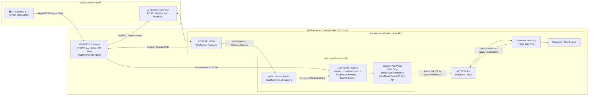

# System Architecture & Data Flow

This document details the decoupled microservices architecture of the Real-Time Multi-Camera Head Pose and Gaze Estimation System on NVIDIA Jetson.

## Core Design Principles

1. **Decoupling AI Inference from Business Logic:**
   - **`vision-pipeline` (C++):** Dedicated to high-throughput hardware-accelerated video decoding, multi-stream multiplexing, object detection, and landmark inference. Zero Python GIL interference.
   - **`analytics-api` (Python):** Handles alert logic, pose smoothing filtering, REST endpoints, and WebSocket broadcasting.

2. **Zero-Copy Hardware Acceleration:**
   - Uses `NvBufSurfTransform` to perform cropping and color space conversion directly in NVMM memory on the GPU before passing tensors to TensorRT.

3. **Dynamic Stream Management:**
   - Addition or removal of RTSP streams happens at runtime via gRPC and dynamic GStreamer pad linking without interrupting existing streams.
